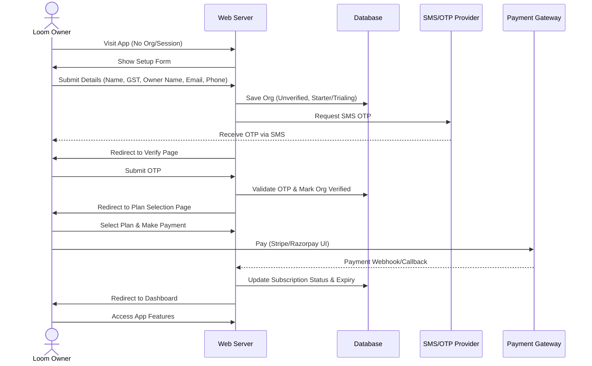
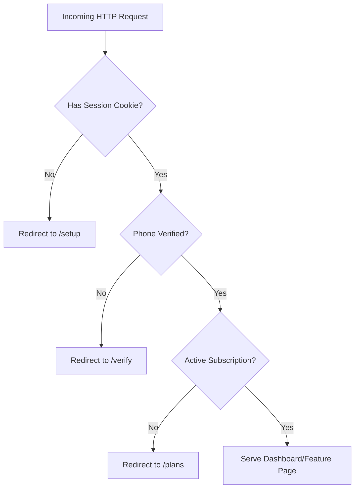

# Enterprise Onboarding, OTP Verification, and Payment Flow Plan

This plan outlines the required database changes, Go backend services, middleware logic, routing, and UI templates to implement a complete onboarding and checkout flow for new loom owners (enterprises).

---

## 1. Flow Overview



---

## 2. Database Schema Changes

To store the extra enterprise details and manage authentication/payment state, we will add a migration `migrations/003_onboarding.up.sql`:

```sql
-- 1. Alter organizations table to add GST, owner email, and OTP state fields
ALTER TABLE organizations 
ADD COLUMN IF NOT EXISTS gst_number TEXT NOT NULL DEFAULT '',
ADD COLUMN IF NOT EXISTS owner_email TEXT NOT NULL DEFAULT '',
ADD COLUMN IF NOT EXISTS phone_verified BOOLEAN NOT NULL DEFAULT FALSE,
ADD COLUMN IF NOT EXISTS otp_code TEXT NOT NULL DEFAULT '',
ADD COLUMN IF NOT EXISTS otp_expires_at TIMESTAMPTZ;

-- 2. Create organization sessions table for authentication
CREATE TABLE IF NOT EXISTS organization_sessions (
    id UUID PRIMARY KEY DEFAULT gen_random_uuid(),
    organization_id UUID NOT NULL REFERENCES organizations(id) ON DELETE CASCADE,
    token TEXT NOT NULL UNIQUE,
    expires_at TIMESTAMPTZ NOT NULL,
    created_at TIMESTAMPTZ NOT NULL DEFAULT now()
);

-- 3. Create index for session performance
CREATE INDEX IF NOT EXISTS idx_sessions_token ON organization_sessions(token);
```

---

## 3. Go Models & Database Layer (`internal/store`)

### Model Updates (`models.go`)
We must update the `Organization` struct to include the new fields:

```go
type Organization struct {
	ID               string    `json:"id"`
	Name             string    `json:"name"`
	GSTNumber        string    `json:"gst_number"`
	OwnerName        string    `json:"owner_name"`
	OwnerEmail       string    `json:"owner_email"`
	Phone            string    `json:"phone"`
	PhoneVerified    bool      `json:"phone_verified"`
	SubscriptionPlan string    `json:"subscription_plan"` // starter, pro, enterprise, inactive
	CreatedAt        time.Time `json:"created_at"`
}
```

### Store Methods (`organizations.go`)
We will add new SQL execution queries to handle OTP generation, validation, and session state:

1. **`CreateOrganization(ctx, org)`**: Save the initial organization details and set `subscription_plan` to `inactive`.
2. **`UpdateOTP(ctx, orgID, otp, expiry)`**: Save the generated OTP and its expiration timestamp.
3. **`VerifyOTP(ctx, orgID, otp)`**: Compare OTP code, check expiration, set `phone_verified = true`, and clear the OTP fields.
4. **`CreateSession(ctx, orgID, token, expiresAt)`**: Insert a new session token mapped to the organization ID.
5. **`GetSession(ctx, token)`**: Fetch organization details via session token.
6. **`UpdateSubscription(ctx, orgID, planName)`**: Update plan status upon successful payment.

---

## 4. OTP Verification System

We need a helper service to manage OTP logic and integrate with an SMS gateway:

- **Interface Definition (`internal/otp`)**:
  ```go
  type SMSProvider interface {
      SendOTP(phone string, code string) error
  }
  ```
- **Local Dev Mock**: In development mode, the `SMSProvider` can simply log the OTP to the console/terminal instead of spending money on SMS APIs.
- **Production Integration**: Twilio or Msg91 integration to dispatch actual SMS codes to loom owners.

---

## 5. Billing & Payment Gateway Integration

Since the user base is located in India (implied by GST number), we'll target integration with payment gateways like **Razorpay** or **Stripe**:

- **Plan Config**:
  - **Free Trial**: Inactive status or basic trialing mode.
  - **Standard Plan**: Monthly/Annual pricing.
  - **Premium Plan**: Multi-loom advanced features.
- **Payment Processing Options**:
  - **Redirect Checkout Flow**: Redirect the loom owner to a hosted payment page, and use webhooks to listen for `payment.success` events.
  - **Direct Client SDK Integration**: Embed a checkout widget in our web UI, verifying the transaction signature on the backend before upgrading the plan.

---

## 6. Authentication & Onboarding Middleware

To guarantee that a loom owner goes through the steps sequentially, we need a custom middleware stack:



---

## 7. Frontend Interface & Routing

We will create a clean, modern web interface matching our dark theme aesthetic:

### Screens (Templ Files)
1. **`views/setup.templ`**: Signup form with fields for Enterprise name, GST, Owner name, Email, and Phone number.
2. **`views/verify.templ`**: Clean OTP input design with a resend button and dynamic status feedback.
3. **`views/plans.templ`**: Standard and Premium tier detail cards. Selecting a tier opens the checkout payment interface.

### Endpoints (ServeMux Router)
| Route | Method | Access Level | Description |
|---|---|---|---|
| `GET /setup` | GET | Public | Renders onboarding/registration form |
| `POST /setup` | POST | Public | Creates unverified organization & redirects to `/verify` |
| `GET /verify` | GET | Unverified | Renders the SMS OTP input page |
| `POST /verify` | POST | Unverified | Validates OTP and updates verification state |
| `GET /plans` | GET | Verified | Shows pricing plan details |
| `POST /checkout` | POST | Verified | Initiates payment gateway session / checkout |
| `GET /payment/callback`| GET | Public | Captures payment redirect & updates database |
| `POST /webhooks/payment`| POST | Public | Handles asynchronous payment webhook events |
| `GET /logout` | GET | Public | Clears session cookie |
